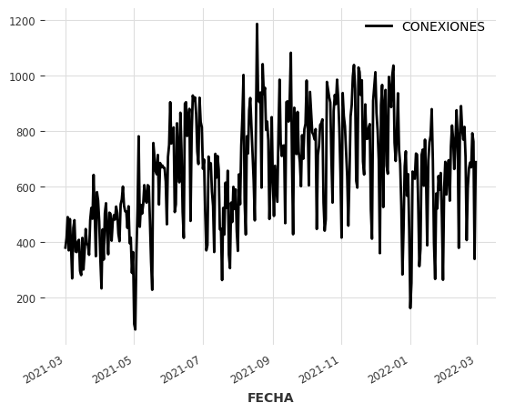
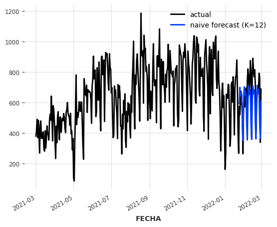
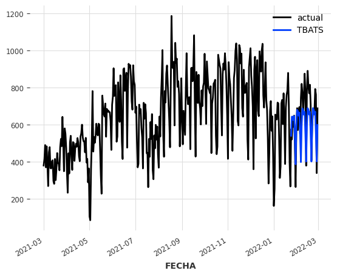
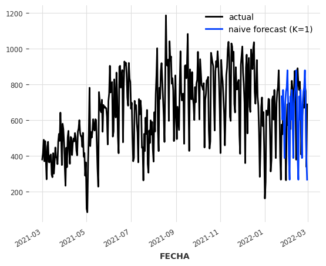
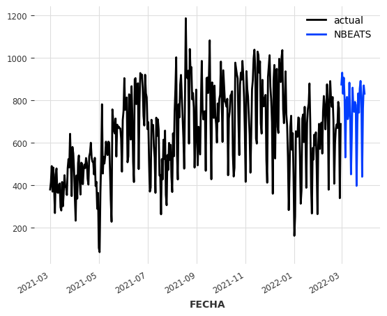

---
jupyter:
  kernelspec:
    display_name: Python 3.8.9 64-bit
    language: python
    name: python3
  language_info:
    codemirror_mode:
      name: ipython
      version: 3
    file_extension: .py
    mimetype: text/x-python
    name: python
    nbconvert_exporter: python
    pygments_lexer: ipython3
    version: 3.8.9
  nbformat: 4
  nbformat_minor: 2
  orig_nbformat: 4
  vscode:
    interpreter:
      hash: e1a9fc0cb9150c8f56f6e4f3637c9ad22bc6cbfea448f3fe2cadad6c957c6e4e
---

::: {.cell .markdown}
# Predicción en serie de tiempo para: Conexiones a zonas Wi-Fi - Alcaldía Mayor de Tunja

A partir de los datos abiertos publicados por la dependencia Dirección
de TIC\'s y Gobierno digital, se realiza la analítica de los datos para
crear un modelo de predicción en serie de tiempo según las conexiones en
zonas Wi-Fi en total.
:::

::: {.cell .code execution_count="4"}
``` {.python}
import pandas as pd


df = pd.read_csv('Informaci_n_Usuarios_Conectados_en_Zonas_Wifi_del_Municipio_de_Tunja__Boyac_.csv', parse_dates=[1])
df.head()
```

::: {.output .execute_result execution_count="4"}
```{=html}
<div>
<style scoped>
    .dataframe tbody tr th:only-of-type {
        vertical-align: middle;
    }

    .dataframe tbody tr th {
        vertical-align: top;
    }

    .dataframe thead th {
        text-align: right;
    }
</style>
<table border="1" class="dataframe">
  <thead>
    <tr style="text-align: right;">
      <th></th>
      <th>ID</th>
      <th>FECHA</th>
      <th>HORA</th>
      <th>ZONA</th>
      <th>SECTOR</th>
      <th>LATITUD</th>
      <th>LONGITUD</th>
      <th>ANIO</th>
      <th>FECHA Y HORA</th>
    </tr>
  </thead>
  <tbody>
    <tr>
      <th>0</th>
      <td>1</td>
      <td>2021-03-01</td>
      <td>07:05:03</td>
      <td>POLIDEPORTIVO_SAN_AN</td>
      <td>3</td>
      <td>5.520588</td>
      <td>-73.356725</td>
      <td>2021</td>
      <td>03/01/2021 07:05:03 AM</td>
    </tr>
    <tr>
      <th>1</th>
      <td>2</td>
      <td>2021-03-01</td>
      <td>08:09:23</td>
      <td>POLIDEPORTIVO_SAN_AN</td>
      <td>3</td>
      <td>5.520588</td>
      <td>-73.356725</td>
      <td>2021</td>
      <td>03/01/2021 08:09:23 AM</td>
    </tr>
    <tr>
      <th>2</th>
      <td>3</td>
      <td>2021-03-01</td>
      <td>08:20:24</td>
      <td>POLIDEPORTIVO_SAN_AN</td>
      <td>3</td>
      <td>5.520588</td>
      <td>-73.356725</td>
      <td>2021</td>
      <td>03/01/2021 08:20:24 AM</td>
    </tr>
    <tr>
      <th>3</th>
      <td>4</td>
      <td>2021-03-01</td>
      <td>08:35:48</td>
      <td>POLIDEPORTIVO_SAN_AN</td>
      <td>3</td>
      <td>5.520588</td>
      <td>-73.356725</td>
      <td>2021</td>
      <td>03/01/2021 08:35:48 AM</td>
    </tr>
    <tr>
      <th>4</th>
      <td>5</td>
      <td>2021-03-01</td>
      <td>09:12:06</td>
      <td>POLIDEPORTIVO_SAN_AN</td>
      <td>3</td>
      <td>5.520588</td>
      <td>-73.356725</td>
      <td>2021</td>
      <td>03/01/2021 09:12:06 AM</td>
    </tr>
  </tbody>
</table>
</div>
```
:::
:::

::: {.cell .markdown}
Se agrupan todas las conexiones de todas las zonas Wi-Fi de Tunja
discriminando por dia.
:::

::: {.cell .code execution_count="15"}
``` {.python}
df1 = df.groupby(df['FECHA'].dt.date).size().reset_index(name='CONEXIONES')
df1.head()
```

::: {.output .execute_result execution_count="15"}
```{=html}
<div>
<style scoped>
    .dataframe tbody tr th:only-of-type {
        vertical-align: middle;
    }

    .dataframe tbody tr th {
        vertical-align: top;
    }

    .dataframe thead th {
        text-align: right;
    }
</style>
<table border="1" class="dataframe">
  <thead>
    <tr style="text-align: right;">
      <th></th>
      <th>FECHA</th>
      <th>CONEXIONES</th>
    </tr>
  </thead>
  <tbody>
    <tr>
      <th>0</th>
      <td>2021-03-01</td>
      <td>381</td>
    </tr>
    <tr>
      <th>1</th>
      <td>2021-03-02</td>
      <td>416</td>
    </tr>
    <tr>
      <th>2</th>
      <td>2021-03-03</td>
      <td>491</td>
    </tr>
    <tr>
      <th>3</th>
      <td>2021-03-04</td>
      <td>371</td>
    </tr>
    <tr>
      <th>4</th>
      <td>2021-03-05</td>
      <td>484</td>
    </tr>
  </tbody>
</table>
</div>
```
:::
:::

::: {.cell .code execution_count="25"}
``` {.python}
df1['FECHA'] = df1['FECHA'].astype(str)
df1['CONEXIONES'] = df1['CONEXIONES'].astype(str)
df1.dtypes
```

::: {.output .execute_result execution_count="25"}
    FECHA         object
    CONEXIONES    object
    dtype: object
:::
:::

::: {.cell .markdown}
Por medio de DARTS se crea una serie de tiempo de los datos, donde su
gráfica se muestra como sigue
:::

::: {.cell .code execution_count="30"}
``` {.python}
from darts import TimeSeries
series = TimeSeries.from_dataframe(df1, 'FECHA', 'CONEXIONES')
series.plot()
```

::: {.output .display_data}

:::
:::

::: {.cell .markdown}
Se dividen los datos para entrenamiento del modelo y validación según
muestra la gráfica
:::

::: {.cell .code execution_count="34"}
``` {.python}
train, val = series.split_after(0.8)

train.plot(label="training")
val.plot(label="validation")
```

::: {.output .display_data}

:::
:::

::: {.cell .markdown}
Se usa un modelo exponencial para inferir predicciones
:::

::: {.cell .code execution_count="39"}
``` {.python}
from darts.models import ExponentialSmoothing
model = ExponentialSmoothing()
model.fit(train)
pred = model.predict(len(val))
series.plot(label="actual")
pred.plot(label="Exponential")
```

::: {.output .display_data}

:::
:::

::: {.cell .markdown}
Si vemos en la gráfica el modelo no se ajusta totalmente a los
resultados de validación, por lo que, se usa otro modelo para inferir un
mejor resultado. De varios modelos calculamos el error porcentual
absoluto medio (MAPE)
:::

::: {.cell .code execution_count="44"}
``` {.python}
from darts.models import ExponentialSmoothing, TBATS, AutoARIMA, Theta
from darts.metrics import mape

def eval_model(model):
    model.fit(train)
    forecast = model.predict(len(val))
    print("model {} obtains MAPE: {:.2f}%".format(model, mape(val, forecast)))


eval_model(ExponentialSmoothing())
eval_model(TBATS())
eval_model(AutoARIMA())
eval_model(Theta())
```

::: {.output .stream .stdout}
    model ExponentialSmoothing(trend=ModelMode.ADDITIVE, damped=False, seasonal=SeasonalityMode.ADDITIVE, seasonal_periods=7 obtains MAPE: 15.04%
    model (T)BATS obtains MAPE: 13.29%
    model Auto-ARIMA obtains MAPE: 23.39%
    model Theta(2) obtains MAPE: 19.79%
:::
:::

::: {.cell .markdown}
De los modelos anteriores se deduce que el menor error de inferencia se
encuentra usando el modelo (T)BATS, por lo tanto se usa el modelo para
predecir.
:::

::: {.cell .code execution_count="46"}
``` {.python}
model = TBATS()
model.fit(train)
pred = model.predict(len(val))
series.plot(label="actual")
pred.plot(label="TBATS")
```

::: {.output .display_data}

:::
:::

::: {.cell .markdown}
Sin embargo, la diferencia de error con el modelo exponencial no es
significante. Ahora probamos un modelo difente. Donde `K = 12` debido a
que los datos pueden presentar un ciclo cada doce meses
:::

::: {.cell .code execution_count="41"}
``` {.python}
from darts.models import NaiveSeasonal

naive_model = NaiveSeasonal(K=12)
naive_model.fit(train)
naive_forecast = naive_model.predict(len(val))

series.plot(label="actual")
naive_forecast.plot(label="naive forecast (K=1)")
```

::: {.output .display_data}

:::
:::

::: {.cell .code execution_count="53"}
``` {.python}
eval_model(NaiveSeasonal(K=12))
```

::: {.output .stream .stdout}
    model Naive seasonal model, with K=12 obtains MAPE: 32.97%
:::
:::

::: {.cell .markdown}
El error que se muestra es mayor para un modelo ajustado por ciclo, como
última instancia, se entrena el modelo basado en Deep Learning usando
los datos de entrenamiento. Hay que tener en cuenta que, debido al rango
de tiempo que se dispone para entrenar es más dificil para el modelo
ajustarse a la gráfica de predicción
:::

::: {.cell .code execution_count="54"}
``` {.python}
from darts.models import NBEATSModel

model_beats = NBEATSModel(input_chunk_length=24, output_chunk_length=12, random_state=42)

model_beats.fit([train], epochs=50, verbose=True);
```

::: {.output .stream .stderr}
    2022-09-15 14:45:52 pytorch_lightning.utilities.rank_zero INFO: GPU available: False, used: False
    2022-09-15 14:45:52 pytorch_lightning.utilities.rank_zero INFO: TPU available: False, using: 0 TPU cores
    2022-09-15 14:45:52 pytorch_lightning.utilities.rank_zero INFO: IPU available: False, using: 0 IPUs
    2022-09-15 14:45:52 pytorch_lightning.utilities.rank_zero INFO: HPU available: False, using: 0 HPUs
    2022-09-15 14:45:52 pytorch_lightning.callbacks.model_summary INFO: 
      | Name          | Type             | Params
    ---------------------------------------------------
    0 | criterion     | MSELoss          | 0     
    1 | train_metrics | MetricCollection | 0     
    2 | val_metrics   | MetricCollection | 0     
    3 | stacks        | ModuleList       | 6.2 M 
    ---------------------------------------------------
    6.2 M     Trainable params
    1.4 K     Non-trainable params
    6.2 M     Total params
    49.575    Total estimated model params size (MB)
:::

::: {.output .stream .stdout}
    Epoch 49: 100%|██████████| 10/10 [00:03<00:00,  3.30it/s, loss=878, train_loss=567.0]       
:::

::: {.output .stream .stderr}
    2022-09-15 14:48:31 pytorch_lightning.utilities.rank_zero INFO: `Trainer.fit` stopped: `max_epochs=50` reached.
:::

::: {.output .stream .stdout}
    Epoch 49: 100%|██████████| 10/10 [00:03<00:00,  3.28it/s, loss=878, train_loss=567.0]
:::
:::

::: {.cell .markdown}
Ahora vamos a usar el modelo para predecir datos de la serie de tiempo
para los proximos 30 dias
:::

::: {.cell .code execution_count="60"}
``` {.python}
pred = model_beats.predict(30, series=series)
series.plot(label="actual")
pred.plot(label="NBEATS")
```

::: {.output .stream .stdout}
    Predicting DataLoader 0: 100%|██████████| 1/1 [00:00<00:00,  4.85it/s]
:::

::: {.output .display_data}

:::
:::

::: {.cell .code execution_count="69"}
``` {.python}
pred.min(axis = 0)
```

::: {.output .execute_result execution_count="69"}
```{=html}
<div><svg style="position: absolute; width: 0; height: 0; overflow: hidden">
<defs>
<symbol id="icon-database" viewBox="0 0 32 32">
<path d="M16 0c-8.837 0-16 2.239-16 5v4c0 2.761 7.163 5 16 5s16-2.239 16-5v-4c0-2.761-7.163-5-16-5z"></path>
<path d="M16 17c-8.837 0-16-2.239-16-5v6c0 2.761 7.163 5 16 5s16-2.239 16-5v-6c0 2.761-7.163 5-16 5z"></path>
<path d="M16 26c-8.837 0-16-2.239-16-5v6c0 2.761 7.163 5 16 5s16-2.239 16-5v-6c0 2.761-7.163 5-16 5z"></path>
</symbol>
<symbol id="icon-file-text2" viewBox="0 0 32 32">
<path d="M28.681 7.159c-0.694-0.947-1.662-2.053-2.724-3.116s-2.169-2.030-3.116-2.724c-1.612-1.182-2.393-1.319-2.841-1.319h-15.5c-1.378 0-2.5 1.121-2.5 2.5v27c0 1.378 1.122 2.5 2.5 2.5h23c1.378 0 2.5-1.122 2.5-2.5v-19.5c0-0.448-0.137-1.23-1.319-2.841zM24.543 5.457c0.959 0.959 1.712 1.825 2.268 2.543h-4.811v-4.811c0.718 0.556 1.584 1.309 2.543 2.268zM28 29.5c0 0.271-0.229 0.5-0.5 0.5h-23c-0.271 0-0.5-0.229-0.5-0.5v-27c0-0.271 0.229-0.5 0.5-0.5 0 0 15.499-0 15.5 0v7c0 0.552 0.448 1 1 1h7v19.5z"></path>
<path d="M23 26h-14c-0.552 0-1-0.448-1-1s0.448-1 1-1h14c0.552 0 1 0.448 1 1s-0.448 1-1 1z"></path>
<path d="M23 22h-14c-0.552 0-1-0.448-1-1s0.448-1 1-1h14c0.552 0 1 0.448 1 1s-0.448 1-1 1z"></path>
<path d="M23 18h-14c-0.552 0-1-0.448-1-1s0.448-1 1-1h14c0.552 0 1 0.448 1 1s-0.448 1-1 1z"></path>
</symbol>
</defs>
</svg>
<style>/* CSS stylesheet for displaying xarray objects in jupyterlab.
 *
 */

:root {
  --xr-font-color0: var(--jp-content-font-color0, rgba(0, 0, 0, 1));
  --xr-font-color2: var(--jp-content-font-color2, rgba(0, 0, 0, 0.54));
  --xr-font-color3: var(--jp-content-font-color3, rgba(0, 0, 0, 0.38));
  --xr-border-color: var(--jp-border-color2, #e0e0e0);
  --xr-disabled-color: var(--jp-layout-color3, #bdbdbd);
  --xr-background-color: var(--jp-layout-color0, white);
  --xr-background-color-row-even: var(--jp-layout-color1, white);
  --xr-background-color-row-odd: var(--jp-layout-color2, #eeeeee);
}

html[theme=dark],
body[data-theme=dark],
body.vscode-dark {
  --xr-font-color0: rgba(255, 255, 255, 1);
  --xr-font-color2: rgba(255, 255, 255, 0.54);
  --xr-font-color3: rgba(255, 255, 255, 0.38);
  --xr-border-color: #1F1F1F;
  --xr-disabled-color: #515151;
  --xr-background-color: #111111;
  --xr-background-color-row-even: #111111;
  --xr-background-color-row-odd: #313131;
}

.xr-wrap {
  display: block !important;
  min-width: 300px;
  max-width: 700px;
}

.xr-text-repr-fallback {
  /* fallback to plain text repr when CSS is not injected (untrusted notebook) */
  display: none;
}

.xr-header {
  padding-top: 6px;
  padding-bottom: 6px;
  margin-bottom: 4px;
  border-bottom: solid 1px var(--xr-border-color);
}

.xr-header > div,
.xr-header > ul {
  display: inline;
  margin-top: 0;
  margin-bottom: 0;
}

.xr-obj-type,
.xr-array-name {
  margin-left: 2px;
  margin-right: 10px;
}

.xr-obj-type {
  color: var(--xr-font-color2);
}

.xr-sections {
  padding-left: 0 !important;
  display: grid;
  grid-template-columns: 150px auto auto 1fr 20px 20px;
}

.xr-section-item {
  display: contents;
}

.xr-section-item input {
  display: none;
}

.xr-section-item input + label {
  color: var(--xr-disabled-color);
}

.xr-section-item input:enabled + label {
  cursor: pointer;
  color: var(--xr-font-color2);
}

.xr-section-item input:enabled + label:hover {
  color: var(--xr-font-color0);
}

.xr-section-summary {
  grid-column: 1;
  color: var(--xr-font-color2);
  font-weight: 500;
}

.xr-section-summary > span {
  display: inline-block;
  padding-left: 0.5em;
}

.xr-section-summary-in:disabled + label {
  color: var(--xr-font-color2);
}

.xr-section-summary-in + label:before {
  display: inline-block;
  content: '►';
  font-size: 11px;
  width: 15px;
  text-align: center;
}

.xr-section-summary-in:disabled + label:before {
  color: var(--xr-disabled-color);
}

.xr-section-summary-in:checked + label:before {
  content: '▼';
}

.xr-section-summary-in:checked + label > span {
  display: none;
}

.xr-section-summary,
.xr-section-inline-details {
  padding-top: 4px;
  padding-bottom: 4px;
}

.xr-section-inline-details {
  grid-column: 2 / -1;
}

.xr-section-details {
  display: none;
  grid-column: 1 / -1;
  margin-bottom: 5px;
}

.xr-section-summary-in:checked ~ .xr-section-details {
  display: contents;
}

.xr-array-wrap {
  grid-column: 1 / -1;
  display: grid;
  grid-template-columns: 20px auto;
}

.xr-array-wrap > label {
  grid-column: 1;
  vertical-align: top;
}

.xr-preview {
  color: var(--xr-font-color3);
}

.xr-array-preview,
.xr-array-data {
  padding: 0 5px !important;
  grid-column: 2;
}

.xr-array-data,
.xr-array-in:checked ~ .xr-array-preview {
  display: none;
}

.xr-array-in:checked ~ .xr-array-data,
.xr-array-preview {
  display: inline-block;
}

.xr-dim-list {
  display: inline-block !important;
  list-style: none;
  padding: 0 !important;
  margin: 0;
}

.xr-dim-list li {
  display: inline-block;
  padding: 0;
  margin: 0;
}

.xr-dim-list:before {
  content: '(';
}

.xr-dim-list:after {
  content: ')';
}

.xr-dim-list li:not(:last-child):after {
  content: ',';
  padding-right: 5px;
}

.xr-has-index {
  font-weight: bold;
}

.xr-var-list,
.xr-var-item {
  display: contents;
}

.xr-var-item > div,
.xr-var-item label,
.xr-var-item > .xr-var-name span {
  background-color: var(--xr-background-color-row-even);
  margin-bottom: 0;
}

.xr-var-item > .xr-var-name:hover span {
  padding-right: 5px;
}

.xr-var-list > li:nth-child(odd) > div,
.xr-var-list > li:nth-child(odd) > label,
.xr-var-list > li:nth-child(odd) > .xr-var-name span {
  background-color: var(--xr-background-color-row-odd);
}

.xr-var-name {
  grid-column: 1;
}

.xr-var-dims {
  grid-column: 2;
}

.xr-var-dtype {
  grid-column: 3;
  text-align: right;
  color: var(--xr-font-color2);
}

.xr-var-preview {
  grid-column: 4;
}

.xr-var-name,
.xr-var-dims,
.xr-var-dtype,
.xr-preview,
.xr-attrs dt {
  white-space: nowrap;
  overflow: hidden;
  text-overflow: ellipsis;
  padding-right: 10px;
}

.xr-var-name:hover,
.xr-var-dims:hover,
.xr-var-dtype:hover,
.xr-attrs dt:hover {
  overflow: visible;
  width: auto;
  z-index: 1;
}

.xr-var-attrs,
.xr-var-data {
  display: none;
  background-color: var(--xr-background-color) !important;
  padding-bottom: 5px !important;
}

.xr-var-attrs-in:checked ~ .xr-var-attrs,
.xr-var-data-in:checked ~ .xr-var-data {
  display: block;
}

.xr-var-data > table {
  float: right;
}

.xr-var-name span,
.xr-var-data,
.xr-attrs {
  padding-left: 25px !important;
}

.xr-attrs,
.xr-var-attrs,
.xr-var-data {
  grid-column: 1 / -1;
}

dl.xr-attrs {
  padding: 0;
  margin: 0;
  display: grid;
  grid-template-columns: 125px auto;
}

.xr-attrs dt,
.xr-attrs dd {
  padding: 0;
  margin: 0;
  float: left;
  padding-right: 10px;
  width: auto;
}

.xr-attrs dt {
  font-weight: normal;
  grid-column: 1;
}

.xr-attrs dt:hover span {
  display: inline-block;
  background: var(--xr-background-color);
  padding-right: 10px;
}

.xr-attrs dd {
  grid-column: 2;
  white-space: pre-wrap;
  word-break: break-all;
}

.xr-icon-database,
.xr-icon-file-text2 {
  display: inline-block;
  vertical-align: middle;
  width: 1em;
  height: 1.5em !important;
  stroke-width: 0;
  stroke: currentColor;
  fill: currentColor;
}
</style><pre class='xr-text-repr-fallback'>&lt;TimeSeries (DataArray) (FECHA: 1, component: 1, sample: 1)&gt;
array([[[397.92453377]]])
Coordinates:
  * FECHA      (FECHA) datetime64[ns] 2022-03-01
  * component  (component) object &#x27;CONEXIONES&#x27;
Dimensions without coordinates: sample
Attributes:
    static_covariates:  None
    hierarchy:          None</pre><div class='xr-wrap' style='display:none'><div class='xr-header'><div class='xr-obj-type'>TimeSeries (DataArray)</div><div class='xr-array-name'></div><ul class='xr-dim-list'><li><span class='xr-has-index'>FECHA</span>: 1</li><li><span class='xr-has-index'>component</span>: 1</li><li><span>sample</span>: 1</li></ul></div><ul class='xr-sections'><li class='xr-section-item'><div class='xr-array-wrap'><input id='section-4703f8ca-530d-4af2-b787-a4ad06babe04' class='xr-array-in' type='checkbox' checked><label for='section-4703f8ca-530d-4af2-b787-a4ad06babe04' title='Show/hide data repr'><svg class='icon xr-icon-database'><use xlink:href='#icon-database'></use></svg></label><div class='xr-array-preview xr-preview'><span>397.9</span></div><div class='xr-array-data'><pre>array([[[397.92453377]]])</pre></div></div></li><li class='xr-section-item'><input id='section-4f423282-ece1-4480-a73f-80e998711dba' class='xr-section-summary-in' type='checkbox'  checked><label for='section-4f423282-ece1-4480-a73f-80e998711dba' class='xr-section-summary' >Coordinates: <span>(2)</span></label><div class='xr-section-inline-details'></div><div class='xr-section-details'><ul class='xr-var-list'><li class='xr-var-item'><div class='xr-var-name'><span class='xr-has-index'>FECHA</span></div><div class='xr-var-dims'>(FECHA)</div><div class='xr-var-dtype'>datetime64[ns]</div><div class='xr-var-preview xr-preview'>2022-03-01</div><input id='attrs-acd31f29-00bf-408d-b8bf-949e99715868' class='xr-var-attrs-in' type='checkbox' disabled><label for='attrs-acd31f29-00bf-408d-b8bf-949e99715868' title='Show/Hide attributes'><svg class='icon xr-icon-file-text2'><use xlink:href='#icon-file-text2'></use></svg></label><input id='data-1e276c2f-3991-4d38-a5e0-3d4fd86cffd3' class='xr-var-data-in' type='checkbox'><label for='data-1e276c2f-3991-4d38-a5e0-3d4fd86cffd3' title='Show/Hide data repr'><svg class='icon xr-icon-database'><use xlink:href='#icon-database'></use></svg></label><div class='xr-var-attrs'><dl class='xr-attrs'></dl></div><div class='xr-var-data'><pre>array([&#x27;2022-03-01T00:00:00.000000000&#x27;], dtype=&#x27;datetime64[ns]&#x27;)</pre></div></li><li class='xr-var-item'><div class='xr-var-name'><span class='xr-has-index'>component</span></div><div class='xr-var-dims'>(component)</div><div class='xr-var-dtype'>object</div><div class='xr-var-preview xr-preview'>&#x27;CONEXIONES&#x27;</div><input id='attrs-28be7c06-1fb7-40b0-a911-872a189f9f21' class='xr-var-attrs-in' type='checkbox' disabled><label for='attrs-28be7c06-1fb7-40b0-a911-872a189f9f21' title='Show/Hide attributes'><svg class='icon xr-icon-file-text2'><use xlink:href='#icon-file-text2'></use></svg></label><input id='data-d2af2c0d-6e3a-4b6d-b91e-143ba703b56b' class='xr-var-data-in' type='checkbox'><label for='data-d2af2c0d-6e3a-4b6d-b91e-143ba703b56b' title='Show/Hide data repr'><svg class='icon xr-icon-database'><use xlink:href='#icon-database'></use></svg></label><div class='xr-var-attrs'><dl class='xr-attrs'></dl></div><div class='xr-var-data'><pre>array([&#x27;CONEXIONES&#x27;], dtype=object)</pre></div></li></ul></div></li><li class='xr-section-item'><input id='section-7e15851b-0848-4a6a-9e12-c8481c09d8ad' class='xr-section-summary-in' type='checkbox'  checked><label for='section-7e15851b-0848-4a6a-9e12-c8481c09d8ad' class='xr-section-summary' >Attributes: <span>(2)</span></label><div class='xr-section-inline-details'></div><div class='xr-section-details'><dl class='xr-attrs'><dt><span>static_covariates :</span></dt><dd>None</dd><dt><span>hierarchy :</span></dt><dd>None</dd></dl></div></li></ul></div></div>
```
:::
:::

::: {.cell .code execution_count="70"}
``` {.python}
pred.max(axis = 0)
```

::: {.output .execute_result execution_count="70"}
```{=html}
<div><svg style="position: absolute; width: 0; height: 0; overflow: hidden">
<defs>
<symbol id="icon-database" viewBox="0 0 32 32">
<path d="M16 0c-8.837 0-16 2.239-16 5v4c0 2.761 7.163 5 16 5s16-2.239 16-5v-4c0-2.761-7.163-5-16-5z"></path>
<path d="M16 17c-8.837 0-16-2.239-16-5v6c0 2.761 7.163 5 16 5s16-2.239 16-5v-6c0 2.761-7.163 5-16 5z"></path>
<path d="M16 26c-8.837 0-16-2.239-16-5v6c0 2.761 7.163 5 16 5s16-2.239 16-5v-6c0 2.761-7.163 5-16 5z"></path>
</symbol>
<symbol id="icon-file-text2" viewBox="0 0 32 32">
<path d="M28.681 7.159c-0.694-0.947-1.662-2.053-2.724-3.116s-2.169-2.030-3.116-2.724c-1.612-1.182-2.393-1.319-2.841-1.319h-15.5c-1.378 0-2.5 1.121-2.5 2.5v27c0 1.378 1.122 2.5 2.5 2.5h23c1.378 0 2.5-1.122 2.5-2.5v-19.5c0-0.448-0.137-1.23-1.319-2.841zM24.543 5.457c0.959 0.959 1.712 1.825 2.268 2.543h-4.811v-4.811c0.718 0.556 1.584 1.309 2.543 2.268zM28 29.5c0 0.271-0.229 0.5-0.5 0.5h-23c-0.271 0-0.5-0.229-0.5-0.5v-27c0-0.271 0.229-0.5 0.5-0.5 0 0 15.499-0 15.5 0v7c0 0.552 0.448 1 1 1h7v19.5z"></path>
<path d="M23 26h-14c-0.552 0-1-0.448-1-1s0.448-1 1-1h14c0.552 0 1 0.448 1 1s-0.448 1-1 1z"></path>
<path d="M23 22h-14c-0.552 0-1-0.448-1-1s0.448-1 1-1h14c0.552 0 1 0.448 1 1s-0.448 1-1 1z"></path>
<path d="M23 18h-14c-0.552 0-1-0.448-1-1s0.448-1 1-1h14c0.552 0 1 0.448 1 1s-0.448 1-1 1z"></path>
</symbol>
</defs>
</svg>
<style>/* CSS stylesheet for displaying xarray objects in jupyterlab.
 *
 */

:root {
  --xr-font-color0: var(--jp-content-font-color0, rgba(0, 0, 0, 1));
  --xr-font-color2: var(--jp-content-font-color2, rgba(0, 0, 0, 0.54));
  --xr-font-color3: var(--jp-content-font-color3, rgba(0, 0, 0, 0.38));
  --xr-border-color: var(--jp-border-color2, #e0e0e0);
  --xr-disabled-color: var(--jp-layout-color3, #bdbdbd);
  --xr-background-color: var(--jp-layout-color0, white);
  --xr-background-color-row-even: var(--jp-layout-color1, white);
  --xr-background-color-row-odd: var(--jp-layout-color2, #eeeeee);
}

html[theme=dark],
body[data-theme=dark],
body.vscode-dark {
  --xr-font-color0: rgba(255, 255, 255, 1);
  --xr-font-color2: rgba(255, 255, 255, 0.54);
  --xr-font-color3: rgba(255, 255, 255, 0.38);
  --xr-border-color: #1F1F1F;
  --xr-disabled-color: #515151;
  --xr-background-color: #111111;
  --xr-background-color-row-even: #111111;
  --xr-background-color-row-odd: #313131;
}

.xr-wrap {
  display: block !important;
  min-width: 300px;
  max-width: 700px;
}

.xr-text-repr-fallback {
  /* fallback to plain text repr when CSS is not injected (untrusted notebook) */
  display: none;
}

.xr-header {
  padding-top: 6px;
  padding-bottom: 6px;
  margin-bottom: 4px;
  border-bottom: solid 1px var(--xr-border-color);
}

.xr-header > div,
.xr-header > ul {
  display: inline;
  margin-top: 0;
  margin-bottom: 0;
}

.xr-obj-type,
.xr-array-name {
  margin-left: 2px;
  margin-right: 10px;
}

.xr-obj-type {
  color: var(--xr-font-color2);
}

.xr-sections {
  padding-left: 0 !important;
  display: grid;
  grid-template-columns: 150px auto auto 1fr 20px 20px;
}

.xr-section-item {
  display: contents;
}

.xr-section-item input {
  display: none;
}

.xr-section-item input + label {
  color: var(--xr-disabled-color);
}

.xr-section-item input:enabled + label {
  cursor: pointer;
  color: var(--xr-font-color2);
}

.xr-section-item input:enabled + label:hover {
  color: var(--xr-font-color0);
}

.xr-section-summary {
  grid-column: 1;
  color: var(--xr-font-color2);
  font-weight: 500;
}

.xr-section-summary > span {
  display: inline-block;
  padding-left: 0.5em;
}

.xr-section-summary-in:disabled + label {
  color: var(--xr-font-color2);
}

.xr-section-summary-in + label:before {
  display: inline-block;
  content: '►';
  font-size: 11px;
  width: 15px;
  text-align: center;
}

.xr-section-summary-in:disabled + label:before {
  color: var(--xr-disabled-color);
}

.xr-section-summary-in:checked + label:before {
  content: '▼';
}

.xr-section-summary-in:checked + label > span {
  display: none;
}

.xr-section-summary,
.xr-section-inline-details {
  padding-top: 4px;
  padding-bottom: 4px;
}

.xr-section-inline-details {
  grid-column: 2 / -1;
}

.xr-section-details {
  display: none;
  grid-column: 1 / -1;
  margin-bottom: 5px;
}

.xr-section-summary-in:checked ~ .xr-section-details {
  display: contents;
}

.xr-array-wrap {
  grid-column: 1 / -1;
  display: grid;
  grid-template-columns: 20px auto;
}

.xr-array-wrap > label {
  grid-column: 1;
  vertical-align: top;
}

.xr-preview {
  color: var(--xr-font-color3);
}

.xr-array-preview,
.xr-array-data {
  padding: 0 5px !important;
  grid-column: 2;
}

.xr-array-data,
.xr-array-in:checked ~ .xr-array-preview {
  display: none;
}

.xr-array-in:checked ~ .xr-array-data,
.xr-array-preview {
  display: inline-block;
}

.xr-dim-list {
  display: inline-block !important;
  list-style: none;
  padding: 0 !important;
  margin: 0;
}

.xr-dim-list li {
  display: inline-block;
  padding: 0;
  margin: 0;
}

.xr-dim-list:before {
  content: '(';
}

.xr-dim-list:after {
  content: ')';
}

.xr-dim-list li:not(:last-child):after {
  content: ',';
  padding-right: 5px;
}

.xr-has-index {
  font-weight: bold;
}

.xr-var-list,
.xr-var-item {
  display: contents;
}

.xr-var-item > div,
.xr-var-item label,
.xr-var-item > .xr-var-name span {
  background-color: var(--xr-background-color-row-even);
  margin-bottom: 0;
}

.xr-var-item > .xr-var-name:hover span {
  padding-right: 5px;
}

.xr-var-list > li:nth-child(odd) > div,
.xr-var-list > li:nth-child(odd) > label,
.xr-var-list > li:nth-child(odd) > .xr-var-name span {
  background-color: var(--xr-background-color-row-odd);
}

.xr-var-name {
  grid-column: 1;
}

.xr-var-dims {
  grid-column: 2;
}

.xr-var-dtype {
  grid-column: 3;
  text-align: right;
  color: var(--xr-font-color2);
}

.xr-var-preview {
  grid-column: 4;
}

.xr-var-name,
.xr-var-dims,
.xr-var-dtype,
.xr-preview,
.xr-attrs dt {
  white-space: nowrap;
  overflow: hidden;
  text-overflow: ellipsis;
  padding-right: 10px;
}

.xr-var-name:hover,
.xr-var-dims:hover,
.xr-var-dtype:hover,
.xr-attrs dt:hover {
  overflow: visible;
  width: auto;
  z-index: 1;
}

.xr-var-attrs,
.xr-var-data {
  display: none;
  background-color: var(--xr-background-color) !important;
  padding-bottom: 5px !important;
}

.xr-var-attrs-in:checked ~ .xr-var-attrs,
.xr-var-data-in:checked ~ .xr-var-data {
  display: block;
}

.xr-var-data > table {
  float: right;
}

.xr-var-name span,
.xr-var-data,
.xr-attrs {
  padding-left: 25px !important;
}

.xr-attrs,
.xr-var-attrs,
.xr-var-data {
  grid-column: 1 / -1;
}

dl.xr-attrs {
  padding: 0;
  margin: 0;
  display: grid;
  grid-template-columns: 125px auto;
}

.xr-attrs dt,
.xr-attrs dd {
  padding: 0;
  margin: 0;
  float: left;
  padding-right: 10px;
  width: auto;
}

.xr-attrs dt {
  font-weight: normal;
  grid-column: 1;
}

.xr-attrs dt:hover span {
  display: inline-block;
  background: var(--xr-background-color);
  padding-right: 10px;
}

.xr-attrs dd {
  grid-column: 2;
  white-space: pre-wrap;
  word-break: break-all;
}

.xr-icon-database,
.xr-icon-file-text2 {
  display: inline-block;
  vertical-align: middle;
  width: 1em;
  height: 1.5em !important;
  stroke-width: 0;
  stroke: currentColor;
  fill: currentColor;
}
</style><pre class='xr-text-repr-fallback'>&lt;TimeSeries (DataArray) (FECHA: 1, component: 1, sample: 1)&gt;
array([[[930.73310477]]])
Coordinates:
  * FECHA      (FECHA) datetime64[ns] 2022-03-01
  * component  (component) object &#x27;CONEXIONES&#x27;
Dimensions without coordinates: sample
Attributes:
    static_covariates:  None
    hierarchy:          None</pre><div class='xr-wrap' style='display:none'><div class='xr-header'><div class='xr-obj-type'>TimeSeries (DataArray)</div><div class='xr-array-name'></div><ul class='xr-dim-list'><li><span class='xr-has-index'>FECHA</span>: 1</li><li><span class='xr-has-index'>component</span>: 1</li><li><span>sample</span>: 1</li></ul></div><ul class='xr-sections'><li class='xr-section-item'><div class='xr-array-wrap'><input id='section-56bc1216-33ad-4c2f-8b3c-80ae484612f3' class='xr-array-in' type='checkbox' checked><label for='section-56bc1216-33ad-4c2f-8b3c-80ae484612f3' title='Show/hide data repr'><svg class='icon xr-icon-database'><use xlink:href='#icon-database'></use></svg></label><div class='xr-array-preview xr-preview'><span>930.7</span></div><div class='xr-array-data'><pre>array([[[930.73310477]]])</pre></div></div></li><li class='xr-section-item'><input id='section-c3ec691f-b35e-46d6-9ea3-fe42fbeebf02' class='xr-section-summary-in' type='checkbox'  checked><label for='section-c3ec691f-b35e-46d6-9ea3-fe42fbeebf02' class='xr-section-summary' >Coordinates: <span>(2)</span></label><div class='xr-section-inline-details'></div><div class='xr-section-details'><ul class='xr-var-list'><li class='xr-var-item'><div class='xr-var-name'><span class='xr-has-index'>FECHA</span></div><div class='xr-var-dims'>(FECHA)</div><div class='xr-var-dtype'>datetime64[ns]</div><div class='xr-var-preview xr-preview'>2022-03-01</div><input id='attrs-bed9271a-cae5-4698-8ed0-6cd74679046d' class='xr-var-attrs-in' type='checkbox' disabled><label for='attrs-bed9271a-cae5-4698-8ed0-6cd74679046d' title='Show/Hide attributes'><svg class='icon xr-icon-file-text2'><use xlink:href='#icon-file-text2'></use></svg></label><input id='data-531a1b1b-2529-4dc1-a17b-76169147eb96' class='xr-var-data-in' type='checkbox'><label for='data-531a1b1b-2529-4dc1-a17b-76169147eb96' title='Show/Hide data repr'><svg class='icon xr-icon-database'><use xlink:href='#icon-database'></use></svg></label><div class='xr-var-attrs'><dl class='xr-attrs'></dl></div><div class='xr-var-data'><pre>array([&#x27;2022-03-01T00:00:00.000000000&#x27;], dtype=&#x27;datetime64[ns]&#x27;)</pre></div></li><li class='xr-var-item'><div class='xr-var-name'><span class='xr-has-index'>component</span></div><div class='xr-var-dims'>(component)</div><div class='xr-var-dtype'>object</div><div class='xr-var-preview xr-preview'>&#x27;CONEXIONES&#x27;</div><input id='attrs-9305a842-4c3f-4e72-abe3-c3eed8545688' class='xr-var-attrs-in' type='checkbox' disabled><label for='attrs-9305a842-4c3f-4e72-abe3-c3eed8545688' title='Show/Hide attributes'><svg class='icon xr-icon-file-text2'><use xlink:href='#icon-file-text2'></use></svg></label><input id='data-3dfe64bf-c048-44a1-9164-d040f459b62a' class='xr-var-data-in' type='checkbox'><label for='data-3dfe64bf-c048-44a1-9164-d040f459b62a' title='Show/Hide data repr'><svg class='icon xr-icon-database'><use xlink:href='#icon-database'></use></svg></label><div class='xr-var-attrs'><dl class='xr-attrs'></dl></div><div class='xr-var-data'><pre>array([&#x27;CONEXIONES&#x27;], dtype=object)</pre></div></li></ul></div></li><li class='xr-section-item'><input id='section-10c0b948-085d-4fa6-9c23-913776e4df51' class='xr-section-summary-in' type='checkbox'  checked><label for='section-10c0b948-085d-4fa6-9c23-913776e4df51' class='xr-section-summary' >Attributes: <span>(2)</span></label><div class='xr-section-inline-details'></div><div class='xr-section-details'><dl class='xr-attrs'><dt><span>static_covariates :</span></dt><dd>None</dd><dt><span>hierarchy :</span></dt><dd>None</dd></dl></div></li></ul></div></div>
```
:::
:::

::: {.cell .code execution_count="68"}
``` {.python}
pred.mean(axis = 0)
```

::: {.output .execute_result execution_count="68"}
```{=html}
<div><svg style="position: absolute; width: 0; height: 0; overflow: hidden">
<defs>
<symbol id="icon-database" viewBox="0 0 32 32">
<path d="M16 0c-8.837 0-16 2.239-16 5v4c0 2.761 7.163 5 16 5s16-2.239 16-5v-4c0-2.761-7.163-5-16-5z"></path>
<path d="M16 17c-8.837 0-16-2.239-16-5v6c0 2.761 7.163 5 16 5s16-2.239 16-5v-6c0 2.761-7.163 5-16 5z"></path>
<path d="M16 26c-8.837 0-16-2.239-16-5v6c0 2.761 7.163 5 16 5s16-2.239 16-5v-6c0 2.761-7.163 5-16 5z"></path>
</symbol>
<symbol id="icon-file-text2" viewBox="0 0 32 32">
<path d="M28.681 7.159c-0.694-0.947-1.662-2.053-2.724-3.116s-2.169-2.030-3.116-2.724c-1.612-1.182-2.393-1.319-2.841-1.319h-15.5c-1.378 0-2.5 1.121-2.5 2.5v27c0 1.378 1.122 2.5 2.5 2.5h23c1.378 0 2.5-1.122 2.5-2.5v-19.5c0-0.448-0.137-1.23-1.319-2.841zM24.543 5.457c0.959 0.959 1.712 1.825 2.268 2.543h-4.811v-4.811c0.718 0.556 1.584 1.309 2.543 2.268zM28 29.5c0 0.271-0.229 0.5-0.5 0.5h-23c-0.271 0-0.5-0.229-0.5-0.5v-27c0-0.271 0.229-0.5 0.5-0.5 0 0 15.499-0 15.5 0v7c0 0.552 0.448 1 1 1h7v19.5z"></path>
<path d="M23 26h-14c-0.552 0-1-0.448-1-1s0.448-1 1-1h14c0.552 0 1 0.448 1 1s-0.448 1-1 1z"></path>
<path d="M23 22h-14c-0.552 0-1-0.448-1-1s0.448-1 1-1h14c0.552 0 1 0.448 1 1s-0.448 1-1 1z"></path>
<path d="M23 18h-14c-0.552 0-1-0.448-1-1s0.448-1 1-1h14c0.552 0 1 0.448 1 1s-0.448 1-1 1z"></path>
</symbol>
</defs>
</svg>
<style>/* CSS stylesheet for displaying xarray objects in jupyterlab.
 *
 */

:root {
  --xr-font-color0: var(--jp-content-font-color0, rgba(0, 0, 0, 1));
  --xr-font-color2: var(--jp-content-font-color2, rgba(0, 0, 0, 0.54));
  --xr-font-color3: var(--jp-content-font-color3, rgba(0, 0, 0, 0.38));
  --xr-border-color: var(--jp-border-color2, #e0e0e0);
  --xr-disabled-color: var(--jp-layout-color3, #bdbdbd);
  --xr-background-color: var(--jp-layout-color0, white);
  --xr-background-color-row-even: var(--jp-layout-color1, white);
  --xr-background-color-row-odd: var(--jp-layout-color2, #eeeeee);
}

html[theme=dark],
body[data-theme=dark],
body.vscode-dark {
  --xr-font-color0: rgba(255, 255, 255, 1);
  --xr-font-color2: rgba(255, 255, 255, 0.54);
  --xr-font-color3: rgba(255, 255, 255, 0.38);
  --xr-border-color: #1F1F1F;
  --xr-disabled-color: #515151;
  --xr-background-color: #111111;
  --xr-background-color-row-even: #111111;
  --xr-background-color-row-odd: #313131;
}

.xr-wrap {
  display: block !important;
  min-width: 300px;
  max-width: 700px;
}

.xr-text-repr-fallback {
  /* fallback to plain text repr when CSS is not injected (untrusted notebook) */
  display: none;
}

.xr-header {
  padding-top: 6px;
  padding-bottom: 6px;
  margin-bottom: 4px;
  border-bottom: solid 1px var(--xr-border-color);
}

.xr-header > div,
.xr-header > ul {
  display: inline;
  margin-top: 0;
  margin-bottom: 0;
}

.xr-obj-type,
.xr-array-name {
  margin-left: 2px;
  margin-right: 10px;
}

.xr-obj-type {
  color: var(--xr-font-color2);
}

.xr-sections {
  padding-left: 0 !important;
  display: grid;
  grid-template-columns: 150px auto auto 1fr 20px 20px;
}

.xr-section-item {
  display: contents;
}

.xr-section-item input {
  display: none;
}

.xr-section-item input + label {
  color: var(--xr-disabled-color);
}

.xr-section-item input:enabled + label {
  cursor: pointer;
  color: var(--xr-font-color2);
}

.xr-section-item input:enabled + label:hover {
  color: var(--xr-font-color0);
}

.xr-section-summary {
  grid-column: 1;
  color: var(--xr-font-color2);
  font-weight: 500;
}

.xr-section-summary > span {
  display: inline-block;
  padding-left: 0.5em;
}

.xr-section-summary-in:disabled + label {
  color: var(--xr-font-color2);
}

.xr-section-summary-in + label:before {
  display: inline-block;
  content: '►';
  font-size: 11px;
  width: 15px;
  text-align: center;
}

.xr-section-summary-in:disabled + label:before {
  color: var(--xr-disabled-color);
}

.xr-section-summary-in:checked + label:before {
  content: '▼';
}

.xr-section-summary-in:checked + label > span {
  display: none;
}

.xr-section-summary,
.xr-section-inline-details {
  padding-top: 4px;
  padding-bottom: 4px;
}

.xr-section-inline-details {
  grid-column: 2 / -1;
}

.xr-section-details {
  display: none;
  grid-column: 1 / -1;
  margin-bottom: 5px;
}

.xr-section-summary-in:checked ~ .xr-section-details {
  display: contents;
}

.xr-array-wrap {
  grid-column: 1 / -1;
  display: grid;
  grid-template-columns: 20px auto;
}

.xr-array-wrap > label {
  grid-column: 1;
  vertical-align: top;
}

.xr-preview {
  color: var(--xr-font-color3);
}

.xr-array-preview,
.xr-array-data {
  padding: 0 5px !important;
  grid-column: 2;
}

.xr-array-data,
.xr-array-in:checked ~ .xr-array-preview {
  display: none;
}

.xr-array-in:checked ~ .xr-array-data,
.xr-array-preview {
  display: inline-block;
}

.xr-dim-list {
  display: inline-block !important;
  list-style: none;
  padding: 0 !important;
  margin: 0;
}

.xr-dim-list li {
  display: inline-block;
  padding: 0;
  margin: 0;
}

.xr-dim-list:before {
  content: '(';
}

.xr-dim-list:after {
  content: ')';
}

.xr-dim-list li:not(:last-child):after {
  content: ',';
  padding-right: 5px;
}

.xr-has-index {
  font-weight: bold;
}

.xr-var-list,
.xr-var-item {
  display: contents;
}

.xr-var-item > div,
.xr-var-item label,
.xr-var-item > .xr-var-name span {
  background-color: var(--xr-background-color-row-even);
  margin-bottom: 0;
}

.xr-var-item > .xr-var-name:hover span {
  padding-right: 5px;
}

.xr-var-list > li:nth-child(odd) > div,
.xr-var-list > li:nth-child(odd) > label,
.xr-var-list > li:nth-child(odd) > .xr-var-name span {
  background-color: var(--xr-background-color-row-odd);
}

.xr-var-name {
  grid-column: 1;
}

.xr-var-dims {
  grid-column: 2;
}

.xr-var-dtype {
  grid-column: 3;
  text-align: right;
  color: var(--xr-font-color2);
}

.xr-var-preview {
  grid-column: 4;
}

.xr-var-name,
.xr-var-dims,
.xr-var-dtype,
.xr-preview,
.xr-attrs dt {
  white-space: nowrap;
  overflow: hidden;
  text-overflow: ellipsis;
  padding-right: 10px;
}

.xr-var-name:hover,
.xr-var-dims:hover,
.xr-var-dtype:hover,
.xr-attrs dt:hover {
  overflow: visible;
  width: auto;
  z-index: 1;
}

.xr-var-attrs,
.xr-var-data {
  display: none;
  background-color: var(--xr-background-color) !important;
  padding-bottom: 5px !important;
}

.xr-var-attrs-in:checked ~ .xr-var-attrs,
.xr-var-data-in:checked ~ .xr-var-data {
  display: block;
}

.xr-var-data > table {
  float: right;
}

.xr-var-name span,
.xr-var-data,
.xr-attrs {
  padding-left: 25px !important;
}

.xr-attrs,
.xr-var-attrs,
.xr-var-data {
  grid-column: 1 / -1;
}

dl.xr-attrs {
  padding: 0;
  margin: 0;
  display: grid;
  grid-template-columns: 125px auto;
}

.xr-attrs dt,
.xr-attrs dd {
  padding: 0;
  margin: 0;
  float: left;
  padding-right: 10px;
  width: auto;
}

.xr-attrs dt {
  font-weight: normal;
  grid-column: 1;
}

.xr-attrs dt:hover span {
  display: inline-block;
  background: var(--xr-background-color);
  padding-right: 10px;
}

.xr-attrs dd {
  grid-column: 2;
  white-space: pre-wrap;
  word-break: break-all;
}

.xr-icon-database,
.xr-icon-file-text2 {
  display: inline-block;
  vertical-align: middle;
  width: 1em;
  height: 1.5em !important;
  stroke-width: 0;
  stroke: currentColor;
  fill: currentColor;
}
</style><pre class='xr-text-repr-fallback'>&lt;TimeSeries (DataArray) (FECHA: 1, component: 1, sample: 1)&gt;
array([[[756.96163847]]])
Coordinates:
  * FECHA      (FECHA) datetime64[ns] 2022-03-01
  * component  (component) object &#x27;CONEXIONES&#x27;
Dimensions without coordinates: sample
Attributes:
    static_covariates:  None
    hierarchy:          None</pre><div class='xr-wrap' style='display:none'><div class='xr-header'><div class='xr-obj-type'>TimeSeries (DataArray)</div><div class='xr-array-name'></div><ul class='xr-dim-list'><li><span class='xr-has-index'>FECHA</span>: 1</li><li><span class='xr-has-index'>component</span>: 1</li><li><span>sample</span>: 1</li></ul></div><ul class='xr-sections'><li class='xr-section-item'><div class='xr-array-wrap'><input id='section-7143a351-6c1c-4a8a-8bdc-0cfa49aa714e' class='xr-array-in' type='checkbox' checked><label for='section-7143a351-6c1c-4a8a-8bdc-0cfa49aa714e' title='Show/hide data repr'><svg class='icon xr-icon-database'><use xlink:href='#icon-database'></use></svg></label><div class='xr-array-preview xr-preview'><span>757.0</span></div><div class='xr-array-data'><pre>array([[[756.96163847]]])</pre></div></div></li><li class='xr-section-item'><input id='section-14c292c4-304b-475d-8561-972d76f25e06' class='xr-section-summary-in' type='checkbox'  checked><label for='section-14c292c4-304b-475d-8561-972d76f25e06' class='xr-section-summary' >Coordinates: <span>(2)</span></label><div class='xr-section-inline-details'></div><div class='xr-section-details'><ul class='xr-var-list'><li class='xr-var-item'><div class='xr-var-name'><span class='xr-has-index'>FECHA</span></div><div class='xr-var-dims'>(FECHA)</div><div class='xr-var-dtype'>datetime64[ns]</div><div class='xr-var-preview xr-preview'>2022-03-01</div><input id='attrs-e09d0a09-79c1-40a5-b7fb-5ba41fed163b' class='xr-var-attrs-in' type='checkbox' disabled><label for='attrs-e09d0a09-79c1-40a5-b7fb-5ba41fed163b' title='Show/Hide attributes'><svg class='icon xr-icon-file-text2'><use xlink:href='#icon-file-text2'></use></svg></label><input id='data-73831ee6-09f8-4a25-aa89-8b6cd902b900' class='xr-var-data-in' type='checkbox'><label for='data-73831ee6-09f8-4a25-aa89-8b6cd902b900' title='Show/Hide data repr'><svg class='icon xr-icon-database'><use xlink:href='#icon-database'></use></svg></label><div class='xr-var-attrs'><dl class='xr-attrs'></dl></div><div class='xr-var-data'><pre>array([&#x27;2022-03-01T00:00:00.000000000&#x27;], dtype=&#x27;datetime64[ns]&#x27;)</pre></div></li><li class='xr-var-item'><div class='xr-var-name'><span class='xr-has-index'>component</span></div><div class='xr-var-dims'>(component)</div><div class='xr-var-dtype'>object</div><div class='xr-var-preview xr-preview'>&#x27;CONEXIONES&#x27;</div><input id='attrs-a2a5a064-11ef-4550-9d52-03b0ef3e9723' class='xr-var-attrs-in' type='checkbox' disabled><label for='attrs-a2a5a064-11ef-4550-9d52-03b0ef3e9723' title='Show/Hide attributes'><svg class='icon xr-icon-file-text2'><use xlink:href='#icon-file-text2'></use></svg></label><input id='data-f4996008-dbfc-4d3f-8a7e-0e89619d29ac' class='xr-var-data-in' type='checkbox'><label for='data-f4996008-dbfc-4d3f-8a7e-0e89619d29ac' title='Show/Hide data repr'><svg class='icon xr-icon-database'><use xlink:href='#icon-database'></use></svg></label><div class='xr-var-attrs'><dl class='xr-attrs'></dl></div><div class='xr-var-data'><pre>array([&#x27;CONEXIONES&#x27;], dtype=object)</pre></div></li></ul></div></li><li class='xr-section-item'><input id='section-cc630838-abbd-4793-ac3d-ea6f3ef6a8ed' class='xr-section-summary-in' type='checkbox'  checked><label for='section-cc630838-abbd-4793-ac3d-ea6f3ef6a8ed' class='xr-section-summary' >Attributes: <span>(2)</span></label><div class='xr-section-inline-details'></div><div class='xr-section-details'><dl class='xr-attrs'><dt><span>static_covariates :</span></dt><dd>None</dd><dt><span>hierarchy :</span></dt><dd>None</dd></dl></div></li></ul></div></div>
```
:::
:::

::: {.cell .markdown}
Según la estimación se espera que las conexiones aumenten, dando un
promedio de 757 conexiones en los próximos 30 días, donde, el día en que
menos conexiones hay, en total habran 398 conexiones
:::
